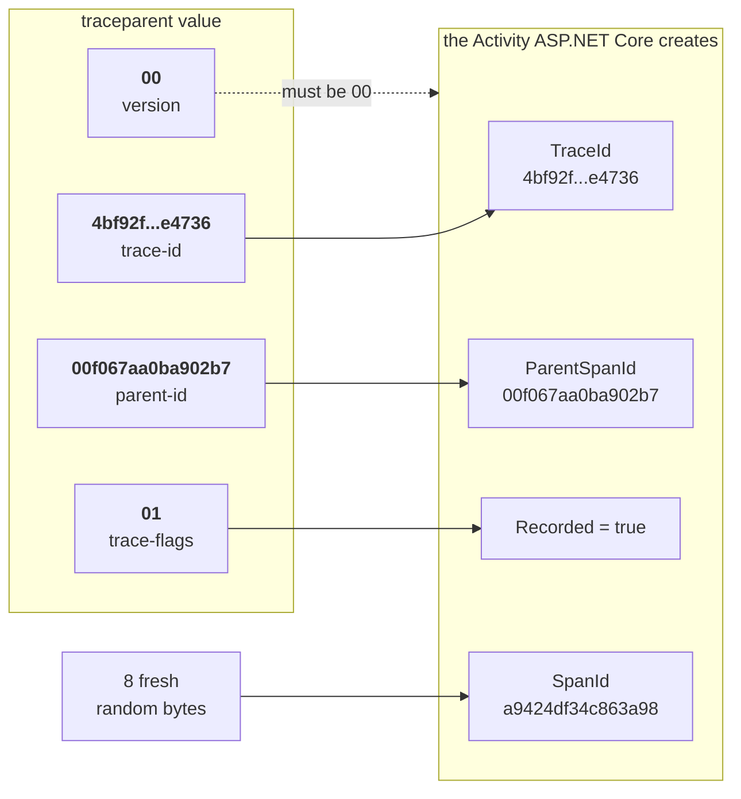
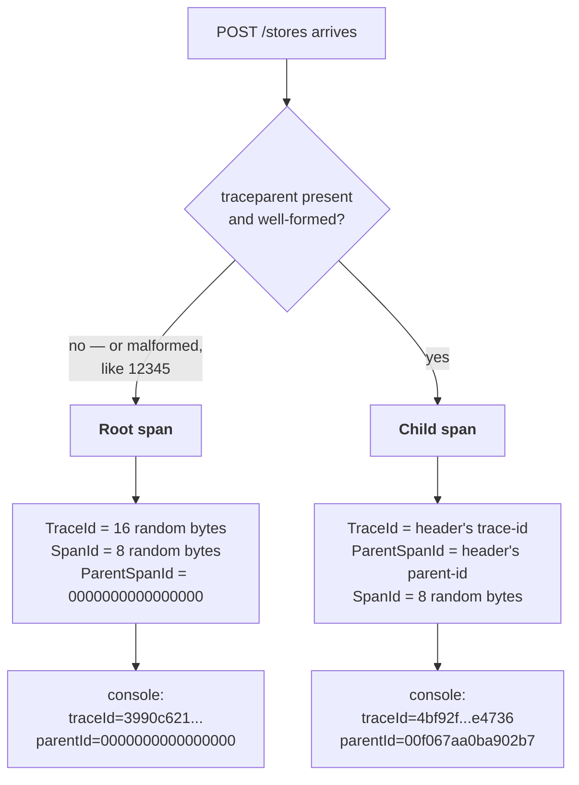

# Phase 1 — Activity, observed

**Question answered:** what is .NET already recording?
**Dependencies added:** none.

## What was built

- The weatherforecast template was replaced with the store domain: a `Store`
  record, a `ConcurrentDictionary<Guid, Store>` singleton, and three endpoints —
  `POST /stores`, `GET /stores/{id}`, `GET /stores`. `Latitude` and `Longitude`
  stay null until phase 6.
- An `ActivityListener` in `Program.cs` that prints every activity's start and
  stop to the console.
- `OpenTelemetry.Api.http` gained a request per endpoint, plus a `POST` carrying
  a hand-written `traceparent` header.

`app.UseHttpsRedirection()` was removed. Under the `http` launch profile there is
no HTTPS port to redirect to, so it only produced a startup warning and got in
the way of manual verification.

## What an Activity is

`System.Diagnostics.Activity` is .NET's span type. It lives in the base class
library — not in a package, and not in OpenTelemetry. It predates OpenTelemetry's
.NET SDK, and the SDK was built to consume it rather than replace it.

Three types matter:

| Type | Role |
|---|---|
| `Activity` | One unit of work: a name, a trace ID, a span ID, a parent, a duration, tags. |
| `ActivitySource` | Creates activities. ASP.NET Core owns one; phase 2 adds ours. |
| `ActivityListener` | Subscribes to sources and decides whether activities get created at all. |

That last row is the surprise. `ActivitySource.StartActivity()` returns `null`
when no listener has opted in, so an uninstrumented application allocates
nothing. Instrumentation is not "off by configuration" — it is off because
nobody asked for the data.

Two properties on the listener control this:

- `ShouldListenTo = _ => true` — subscribe to every source in the process,
  including `Microsoft.AspNetCore.Hosting`.
- `Sample = ... ActivitySamplingResult.AllData` — create the activity and
  populate it. A weaker result produces a hollow activity or none.

This is also the shape of a sampling decision, made per activity before it
exists. Phase 4 revisits it via the `traceparent` flags byte.

## Four terms, kept straight

A **span** is one unit of work — "handle this HTTP request" is a span. A **trace**
is the whole journey: every span belonging to one operation, across however many
services.

| Field | Answers | Regenerated per span? |
|---|---|---|
| `traceId` | Which journey does this belong to? | No — shared by the whole trace |
| `spanId` | Who am I? | **Always**, 8 random bytes |
| `parentId` | Who caused me? | Inherited from the caller, or all zeros |

The trap is that `parentId` and `spanId` hold the same *kind* of value. They
differ only in perspective: today's `parentId` was somebody else's `spanId`
yesterday. Follow the parent links upward and the trace tree reassembles.

## Anatomy of a traceparent header

```
traceparent: 00-4bf92f3577b34da6a3ce929d0e0e4736-00f067aa0ba902b7-01
             ─┬ ────────────────┬─────────────── ───────┬──────── ─┬
              1                 2                       3          4
```

| # | W3C field name | Becomes, in the receiver |
|---|---|---|
| 1 | `version` | nothing — validated, must be `00` |
| 2 | `trace-id` | `Activity.TraceId`, copied verbatim |
| 3 | `parent-id` | `Activity.ParentSpanId` |
| 4 | `trace-flags` | the sampled bit (`01` = sampled) |

Field 3 is called **`parent-id`**, not "span id" — worth insisting on, because
the sender writes *its own span ID* into that slot and the receiver reads it as
*its parent*. One value, two names, depending which end you stand at. Nothing in
the header describes the receiver: the receiver does not exist yet when the
header is written.



Note which arrow does not originate in the header: `SpanId`. It has no source in
`traceparent` at all.

## How the span is built, with and without the header



A malformed header is discarded rather than honoured, and the request falls back
to the root branch. That is deliberate: a caller sending junk should not be able
to poison the receiver's telemetry.

## What to look for when running it

Start the API (`http` profile) and send the requests in `OpenTelemetry.Api.http`
top to bottom.

The plain `POST /stores` prints a span with a trace ID .NET invented and an
all-zero parent:

```
[start] Microsoft.AspNetCore.Hosting.HttpRequestIn kind=Server traceId=1bd946467d5a6abf9e77976f925e75c1 spanId=55874424c5333fb0 parentId=0000000000000000
[stop ] Microsoft.AspNetCore.Hosting.HttpRequestIn kind=Server traceId=1bd946467d5a6abf9e77976f925e75c1 spanId=55874424c5333fb0 parentId=0000000000000000 duration=132.8ms tags=[]
```

The second `POST` sends this header:

```
traceparent: 00-4bf92f3577b34da6a3ce929d0e0e4736-00f067aa0ba902b7-01
```

and produces:

```
[stop ] Microsoft.AspNetCore.Hosting.HttpRequestIn kind=Server traceId=4bf92f3577b34da6a3ce929d0e0e4736 spanId=10d655d333310dd1 parentId=00f067aa0ba902b7 duration=0.9ms
```

The trace ID is the one that was typed by hand, and `parentId` is the span ID
that was typed by hand. The new request got a fresh `spanId` of its own and
attached itself underneath.

Nothing in `Program.cs` reads that header. ASP.NET Core parses it, per the W3C
Trace Context standard, with no configuration and no library. This is the
mechanism that in phase 6 will stitch two processes into one trace — and it is
already working, in a project with zero dependencies.

## One thing that is missing on purpose

`DisplayName` is the raw source name `Microsoft.AspNetCore.Hosting.HttpRequestIn`
rather than something readable like `POST /stores`, and `tags` is empty — no
`http.request.method`, no `http.route`, no status code.

Those come from ASP.NET Core's `DiagnosticListener` enrichment path, which a bare
`ActivityListener` does not switch on. The framework gives us the span and its
trace context for free; the HTTP semantic attributes arrive in phase 5 when
`AddAspNetCoreInstrumentation()` subscribes to that path properly.

Worth holding onto, because it sharpens the division of labour: **.NET creates
the activities, instrumentation libraries describe them, and OpenTelemetry only
collects them.**

## Where OpenTelemetry is in all this

Nowhere. There is not one OpenTelemetry package in the project, and there is a
working trace with correct W3C context propagation.

In phase 5 the listener above gets deleted and the OpenTelemetry SDK registered
in its place. The endpoints will not change, and neither will the spans they
produce — only who is listening, and where the data goes afterwards.
