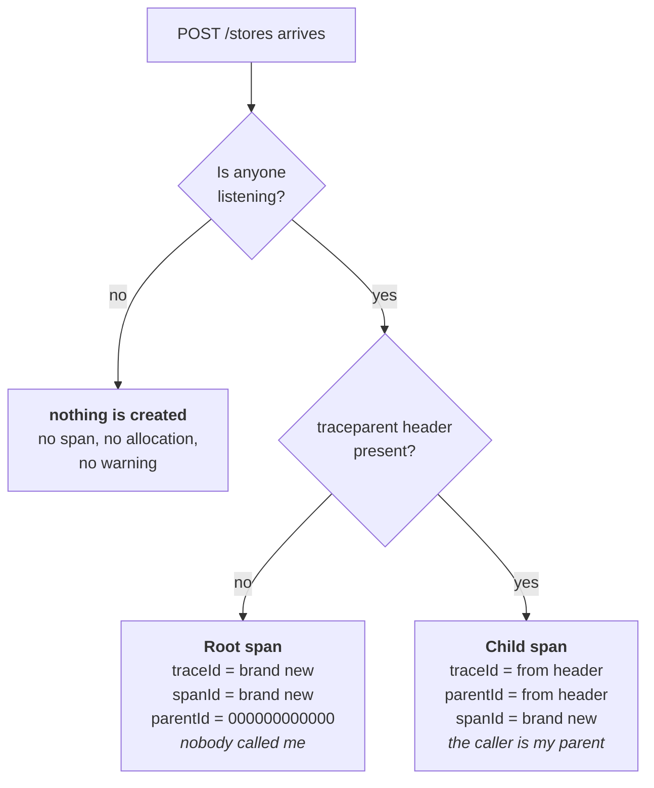

# Phase 2 — Custom spans and attributes

**Question answered:** how is business context attached to an operation?
**Dependencies added:** none.

## What was built

- `Telemetry.cs` — a static `ActivitySource` named `OpenTelemetry.Api`, plus the
  name as a `const` because two places need it.
- `Program.cs`, the listener — `ShouldListenTo` now matches our source as well as
  `Microsoft.AspNetCore`.
- `Program.cs`, `POST /stores` — the dictionary write is wrapped in a
  `CreateStore` span carrying `store.id` and `store.name`.

Three small edits. Still no packages.

## Recap — how a span gets created

Before adding a span of our own, it is worth drawing the path a request already
takes. Two decisions stand between an incoming request and a span existing.



The first decision is phase 1's lesson: instrumentation is not off by
configuration, it is off because nobody asked for the data. The second is the
W3C Trace Context rule, applied by ASP.NET Core with no code of ours involved.

Read the two outcomes side by side and one field behaves the same in both:
`spanId` is always brand new. A span never adopts an ID from anywhere. Which
answers a question worth asking out loud — *why does an incoming `traceparent`
carry a span ID when we never created a span?* Because that ID was not ours. It
was created by whoever called us, in their process, before our request existed.

## Vocabulary

| Term | Answers |
|---|---|
| span | One thing that happened, and how long it took |
| trace | The whole journey — every span in one operation |
| `spanId` | Who am I? Random, regenerated for every span |
| `parentId` | Who caused me? All zeros if nothing did |
| `traceId` | Which journey am I part of? Identical across the trace |
| `traceparent` | The header carrying `traceId` and the caller's `spanId` across the wire |

## An ActivitySource of our own

```csharp
public static class Telemetry
{
    public const string SourceName = "OpenTelemetry.Api";

    public static readonly ActivitySource Source = new(SourceName, "1.0.0");
}
```

Static, and created once for the lifetime of the process. An `ActivitySource` is
not a per-request object and does not belong in the DI container — it is a
factory that instrumented code reaches for directly, the same way ASP.NET Core
reaches for its own.

The name is a `const` because two places need the same string: the code that
starts activities, and the listener that decides whether to allow them. That
second one is easy to forget, which is the subject of the first trap below.

## Starting the span

```csharp
using (var activity = Telemetry.Source.StartActivity("CreateStore"))
{
    activity?.SetTag("store.id", store.Id);
    activity?.SetTag("store.name", store.Name);

    stores[store.Id] = store;
}
```

Two details carry weight.

`using` is not tidiness. Disposing the activity is what stops the clock and
fires `ActivityStopped`. Without it the span never ends and never prints.

`StartActivity` returns `Activity?` — null whenever nobody is listening — so
every call on it is null-conditional. This is the shape all instrumented code
takes: it must not crash a process that has instrumentation switched off. The
telemetry is allowed to disappear; the business logic is not allowed to notice.

Nothing here mentions a parent. `CreateStore` attaches itself underneath the
request span on its own, because `Activity.Current` is ambient — it flows with
the execution context via `AsyncLocal`. Phase 3 leans on the same mechanism from
inside an exception handler.

## Attributes versus string interpolation

The same fact can be recorded two ways:

```csharp
logger.LogInformation($"Created store {store.Id} named {store.Name}");   // text
activity?.SetTag("store.id", store.Id);                                  // field
```

The first produces a sentence. To find it later you search for a substring, and
you can only ask questions the sentence's author happened to anticipate.

The second produces a field on the span. It survives as structured data all the
way into the backend, which means `store.id = 16e11db2…` becomes a filter rather
than a grep — and filters compose. "Every trace touching this store, that took
over 500ms, in the last week" is one query against fields and an impossible
query against sentences.

This is the answer to the third problem the project was started for: a
structured place to put business context. Phase 7 returns to the same idea from
the logging side.

## Naming: two different namespaces

| Tag | Who owns the name |
|---|---|
| `http.request.method`, `http.route`, `server.address` | OpenTelemetry semantic conventions |
| `store.id`, `store.name` | This application |

Semantic conventions are a published registry of attribute names, so that a
backend can build a chart of request latency without knowing anything about the
service. Do not invent names inside those namespaces, and do not use one from
the registry to mean something it does not.

Application-specific attributes are yours to name, following the same house
style: lowercase, dot-separated, singular prefix, no spaces or capitals.
`store.id`, not `StoreId` or `store_id`. The prefix `store.` acts as a namespace
in exactly the way `http.` does.

## What does not go in a tag

Tags travel. They leave the process, cross the network to a vendor, get indexed,
get retained, and become visible to anyone with access to the tracing backend —
which is usually a wider audience than the database.

So: no names of people, no email addresses, no phone numbers, no tokens, no
authorization headers, no full request bodies. `store.name` is fine because a
store is a business, not a person. A `customer.email` tag would not be.

The general rule is that a span attribute should be something you could paste
into a support ticket. An ID is; a payload is not.

## What to look for when running it

Start the API and send the first `POST /stores` from `OpenTelemetry.Api.http`.
Four lines appear where phase 1 produced two:

```
[start] Microsoft.AspNetCore.Hosting.HttpRequestIn kind=Server traceId=7ef921d791eba3870dce9377d4c08399 parentId=0000000000000000 spanId=156bd91237d01c79
[start] CreateStore kind=Internal traceId=7ef921d791eba3870dce9377d4c08399 parentId=156bd91237d01c79 spanId=c538868744b50c05
[stop ] CreateStore kind=Internal traceId=7ef921d791eba3870dce9377d4c08399 parentId=156bd91237d01c79 spanId=c538868744b50c05 duration=1.3ms tags=[store.id=16e11db2-cf17-4039-9b8d-f0aa59f95b31, store.name=mamak]
[stop ] Microsoft.AspNetCore.Hosting.HttpRequestIn kind=Server traceId=7ef921d791eba3870dce9377d4c08399 parentId=0000000000000000 spanId=156bd91237d01c79 duration=69.6ms tags=[]
```

Four lines, two spans: the listener prints each span once on start and once on
stop, and only `duration` differs between the pair.

Three things to read off it:

- `CreateStore`'s `parentId` equals `HttpRequestIn`'s `spanId`. The nesting was
  never configured — the child found its parent through `Activity.Current`.
- Both spans share one `traceId`.
- The child carries tags; the parent still shows `tags=[]`, exactly as in phase
  1. Ours describes the work, the framework's describes nothing until phase 5.

And a fourth, which is the reason the outer span is worth having at all:

```
CreateStore     1.3ms
HttpRequestIn  69.6ms
```

The save took 1.3ms and the caller waited 69.6ms. Roughly 68ms went to model
binding, routing, serialisation and response writing. A span around only your
own code would have reported "all good" and hidden the other 98% of the request.

`GET /stores` still prints two lines. One operation was instrumented, not the
application.

## Two traps, both hit while building this

**A source nobody subscribed to is silent.** The first run produced no
`CreateStore` span at all, because `ShouldListenTo` still matched only
`Microsoft.AspNetCore`. `StartActivity` returned null, every `activity?.SetTag`
short-circuited, and nothing was logged, thrown or warned about. Phase 1 stated
this rule; phase 2 is where it bites. If a custom span is missing, check the
listener before checking the code that starts it.

**`SetTag` with a null value does not create a tag.** The second run showed
`store.id` but no `store.name` — because the request body had misspelled `name`,
so `Store.Name` bound to null, and `SetTag("store.name", null)` removes the key
rather than storing an empty value. A missing tag can mean the instrumentation
is wrong, or it can mean the data was null. Check the data first.

## A question parked for later

*Why not set tags in middleware, instead of cluttering every endpoint?*

Because middleware cannot know most of them. `store.id` does not exist until the
handler calls `Guid.NewGuid()`, and middleware runs around the handler rather
than inside it.

The split is worth keeping:

- **Facts the request carries** — route, method, a client ID header, a tenant
  claim. Central enrichment suits these, and phase 5 shows that OpenTelemetry
  already ships a hook for them.
- **Facts the operation produces** — the new ID, the row count, which branch ran.
  Only the code doing the work can set these.

Middleware itself arrives in phase 4, for a different job.
