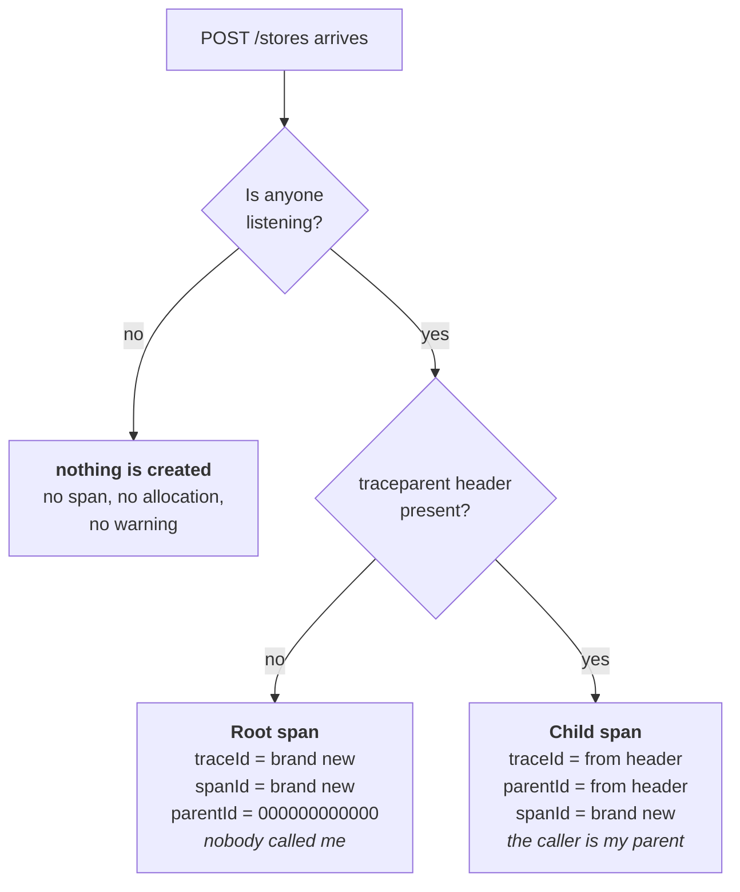

# Phase 2 — Custom spans and attributes

**Question answered:** how is business context attached to an operation?
**Dependencies added:** none.

## Recap — how a span gets created

Before adding a span of our own, it is worth drawing the path a request already
takes. Two decisions stand between an incoming request and a span existing.

The first decision is phase 1's lesson: instrumentation is not off by
configuration, it is off because nobody asked for the data. The second is the
W3C Trace Context rule, applied by ASP.NET Core with no code of ours involved.

Read the two outcomes side by side and one field behaves the same in both:
`spanId` is always brand new. A span never adopts an ID from anywhere. Which
answers a question worth asking out loud — *why does an incoming `traceparent`
carry a span ID when we never created a span?* Because that ID was not ours. It
was created by whoever called us, in their process, before our request existed.

## Vocabulary

| Term | Answers |
|---|---|
| span | One thing that happened, and how long it took |
| trace | The whole journey — every span in one operation |
| `spanId` | Who am I? Random, regenerated for every span |
| `parentId` | Who caused me? All zeros if nothing did |
| `traceId` | Which journey am I part of? Identical across the trace |
| `traceparent` | The header carrying `traceId` and the caller's `spanId` across the wire |
