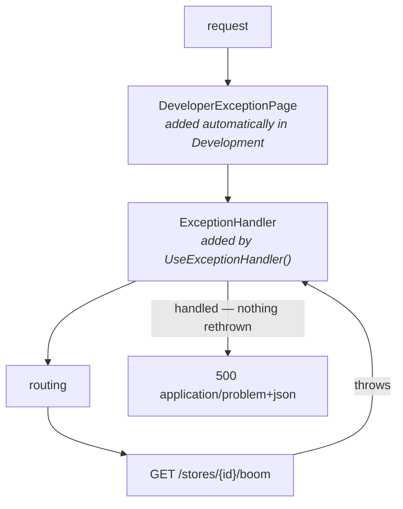

# Phase 3 — Exceptions and ProblemDetails

**Question answered:** should there be a global exception handler, and how does an
exception reach the trace?
**Dependencies added:** none.

## What was built

- `GlobalExceptionHandler.cs` — an `IExceptionHandler` that marks the current
  activity as failed and writes an RFC 9457 response.
- `Program.cs`, registration — `AddProblemDetails()`,
  `AddExceptionHandler<GlobalExceptionHandler>()`, `app.UseExceptionHandler()`.
- `Program.cs`, `GET /stores/{id}/boom` — throws on purpose.
- `Program.cs`, the listener — now prints `status` and activity events, without
  which the exception is invisible in the console.

Still no packages.

## Start by watching it break

Before adding the handler, `/boom` was called with nothing catching it. Two
separate failures, and it is worth seeing them apart from each other.

The response, in Development:

```
HTTP/1.1 500
Content-Type: text/plain; charset=utf-8

System.InvalidOperationException: Deliberate failure for store 1111…
   at Program.<>c.<<Main>$>b__0_3(Guid id) in …\Program.cs:line 100
```

A stack trace as plain text — and only because the developer exception page is
on. In Production the same request returns 500 with an empty body. Neither is
something a client can code against.

The span:

```
[start] HttpRequestIn kind=Server traceId=94d41de5… spanId=e4ca8027a227e6ab
fail:  An unhandled exception has occurred while executing the request.
[stop ] HttpRequestIn kind=Server traceId=94d41de5… duration=159.9ms tags=[]
```

Read those three lines together. The `fail:` line came from the **logger** and
knows everything — type, message, line number. The span sitting either side of
it knows nothing: it stopped with `tags=[]` and no hint that anything went wrong.

That is the lesson of the phase in one screenshot. Logs and traces are two
separate recording systems. An exception lands in the one you deliberately write
it to, and in a tracing backend this request would have looked like a healthy
160ms call.

## Where the handler sits

The ASP.NET Core pipeline nests rather than runs in sequence; each middleware
wraps everything registered after it.



`ExceptionHandlerMiddleware` is a `try`/`catch` around everything inside it.
Because it sits *inside* the developer exception page, it catches first, and
nothing rethrows — which is why the stack-trace response disappears the moment
the handler is registered.

## Three registrations, three different jobs

```csharp
builder.Services.AddProblemDetails();
builder.Services.AddExceptionHandler<GlobalExceptionHandler>();
…
app.UseExceptionHandler();
```

| Line | Job |
|---|---|
| `AddProblemDetails()` | Registers `IProblemDetailsService` — the thing that knows how to write an RFC 9457 body |
| `AddExceptionHandler<T>()` | Registers *our* class so the middleware calls it |
| `UseExceptionHandler()` | Puts the `try`/`catch` in the pipeline |

The relationship in one sentence: **`AddProblemDetails()` registers the writer;
the exception handler is what calls it.**

`AddProblemDetails()` is not optional here for two reasons — the handler
constructor-injects `IProblemDetailsService`, and the parameterless
`UseExceptionHandler()` requires it too.

## The handler

```csharp
internal sealed class GlobalExceptionHandler(IProblemDetailsService problemDetailsService)
    : IExceptionHandler
{
    public async ValueTask<bool> TryHandleAsync(
        HttpContext httpContext, Exception exception, CancellationToken cancellationToken)
    {
        var activity = Activity.Current;
        activity?.SetStatus(ActivityStatusCode.Error, exception.Message);
        activity?.AddException(exception);

        httpContext.Response.StatusCode = StatusCodes.Status500InternalServerError;

        return await problemDetailsService.TryWriteAsync(new ProblemDetailsContext
        {
            HttpContext = httpContext,
            Exception = exception,
            ProblemDetails = new ProblemDetails
            {
                Status = StatusCodes.Status500InternalServerError,
                Title = "An unexpected error occurred.",
                Detail = "The request could not be completed."
            }
        });
    }
}
```

### The bool is the interesting part of the interface

`TryHandleAsync` returns `true` for "I wrote the response, stop" and `false` for
"not mine, try the next handler". The middleware asks each registered handler in
registration order until one says `true`.

That is what makes this better than one middleware with a growing `switch`: a
handler per exception type — `ValidationException` → 400, `NotFoundException` →
404, a catch-all last — each in its own file.

There is no literal `true` in the code above. The `return` on the last statement
hands back whatever `TryWriteAsync` returned, which is `true` when a response was
written. Worth noticing, because *writing a response and then returning `false`*
would be a bug: the middleware would carry on to the next handler.

### Nothing passed it the activity

The signature is `(HttpContext, Exception, CancellationToken)`. No trace ID, no
span, no activity. The handler reaches for `Activity.Current` — a static property
— and the activity belonging to this specific in-flight request is already there.

This replaces the "middleware passes the trace ID down the pipeline" model with
the real one. `Activity.Current` is backed by `AsyncLocal<T>`, so the value is
scoped to the async call chain rather than to a thread or to a parameter list. It
survives `await`, thread-pool hops and every middleware layer in between. Code
five calls deep that was handed nothing can still reach it — which is exactly how
`CreateStore` found its parent in phase 2, seen from the other end.

### Why `Detail` does not contain the exception message

Error bodies are public. `exception.Message` regularly contains connection
strings, file paths and internal identifiers. The full detail goes on the span,
which is an internal system; the response gets a fixed sentence and a trace ID to
quote. Same rule as phase 2's "what does not go in a tag".

## What the console shows now

```
[stop ] HttpRequestIn kind=Server traceId=5dd9b5d1… duration=1.3ms status=Error tags=[] events=[exception]
         exception.type=System.InvalidOperationException
         exception.message=Deliberate failure for store 2222…
         exception.stacktrace=System.InvalidOperationException: …
```

And the response:

```json
{
  "type": "https://tools.ietf.org/html/rfc9110#section-15.6.1",
  "title": "An unexpected error occurred.",
  "status": 500,
  "detail": "The request could not be completed.",
  "traceId": "00-5dd9b5d1bd64dd7e0772186b67375f57-bd1ec14682386d2e-00"
}
```

## An exception is an event, not a tag

The listener needed changing before any of that was visible. `AddException` does
not add tags — it appends an `ActivityEvent` named `exception`, carrying
`exception.type`, `exception.message` and `exception.stacktrace` as the event's
own tags. `SetStatus` writes to `Activity.Status`, which the listener was not
printing either.

So the phase-2 listener would have shown `tags=[]` on a fully instrumented
failure. Both had to be added:

```csharp
var events = string.Join(", ", activity.Events.Select(e => e.Name));
… $"status={activity.Status} tags=[{tags}] events=[{events}]"
```

The distinction is real and carries into phase 5: a **tag** is a fact true for
the whole span, a **event** is something that happened at a point in time within
it. An exception has a timestamp, so it is an event.

## Two traps

**A bare `throw` lambda picks the wrong overload.** The first version of `/boom`
was an expression-bodied lambda:

```csharp
app.MapGet("/stores/{id:guid}/boom", (Guid id) =>
    throw new InvalidOperationException(…));   // CS1678
```

A `throw` expression has no return type to infer, so overload resolution falls
back to `MapGet(string, RequestDelegate)` and demands an `HttpContext` parameter.
A statement body makes it an `Action<Guid>` and the minimal-API overload applies.

**`AddProblemDetails()` alone already writes a problem response.** Making the
handler `return false` and rerunning `/boom` still produced valid problem+json:

| | fallback (`return false`) | our `TryWriteAsync` |
|---|---|---|
| `title` | `An error occurred while processing your request.` | `An unexpected error occurred.` |
| `detail` | absent | set |
| status | always 500 | ours to choose |
| log | `fail: An unhandled exception has occurred` on every request | none |

So the explicit write is not what makes the response RFC 9457 — it is what makes
the body ours to control, and what stops every handled error being logged as
unhandled. The span was marked `Error` in both runs, because that work happens
before the return either way. The two concerns are independent.

## Already done, ahead of schedule

`traceId` appears in the body above, and nothing in this repo put it there.
`AddProblemDetails()` adds it automatically, reading `Activity.Current` itself —
the same ambient lookup the handler does by hand.

That is half of phase 4's payload work already finished by the framework. Phase 4
still has the `traceparent` response header to add, and the value above is worth
a second look when it gets there: `00-5dd9b5d1…-bd1ec14682386d2e-00` is a full
`traceparent`, not a bare trace ID, and it ends in `-00`.

## Verifying it

Run the API and send the `/boom` request from `OpenTelemetry.Api.http`. Expect a
500 with `Content-Type: application/problem+json`, no stack trace in the body,
and a console `[stop ]` line reading `status=Error` with an `exception` event
underneath it.
