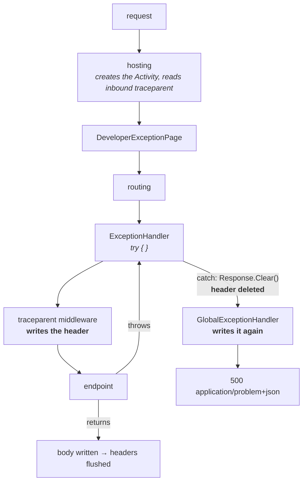

# Phase 4 — traceparent on the response

**Question answered:** what is the `traceparent` header, and how is it returned to
a caller?
**Dependencies added:** none.

## What was built

- `Program.cs`, middleware — eight lines that write `Activity.Current.Id` to the
  `traceparent` response header, registered after `app.UseExceptionHandler()`.
- `GlobalExceptionHandler.cs` — re-stamps the same header, because the framework
  deletes the middleware's copy on the error path. Explained below.
- `Program.cs`, the listener — `AllData` became `AllDataAndRecorded`, which is
  what makes the header's sampled flag honest.
- `OpenTelemetry.Api.http` — requests that read the header back, with and without
  an inbound `traceparent`.

Still no packages. Four phases in, nothing has been installed.

## The header, field by field

```
traceparent: 00-4bf92f3577b34da6a3ce929d0e0e4736-00f067aa0ba902b7-01
             ── ──────────────────────────────── ──────────────── ──
             1  2                                3                4
```

| # | Field | Size | Meaning |
|---|---|---|---|
| 1 | version | 2 hex | `00` is the only version defined. A parser that sees something higher must still try to read fields 2–4. |
| 2 | trace id | 32 hex | The journey. Identical across every service the request touches. All-zero is invalid. |
| 3 | parent span id | 16 hex | The *sender's* span — from the receiver's point of view, its parent. Not the trace's root. |
| 4 | trace flags | 2 hex | A bit field. Only bit 0 is defined: `01` sampled, `00` not. |

Field 3 is the one that reads wrong at first. The name is written from the
receiver's perspective: whoever gets this header should treat that span as their
parent. It is not "the first span in the trace".

`Activity.Id` already returns this exact string. There is nothing to assemble by
hand — .NET formats `TraceId`, `SpanId` and `ActivityTraceFlags` into W3C form
because `Activity` was built against this spec.

### Observed

```
sent:     00-4bf92f3577b34da6a3ce929d0e0e4736-00f067aa0ba902b7-01
returned: 00-4bf92f3577b34da6a3ce929d0e0e4736-860c92c4106156f9-01
                ↑ same trace                    ↑ different span
```

Same journey, new participant. That is distributed tracing's entire contract, and
here it happens with no library involved.

## Why the header is written on the way in

The middleware writes the header *before* `await next()`:

```csharp
app.Use(async (context, next) =>
{
    var activity = Activity.Current;

    if (activity is not null)
    {
        context.Response.Headers.TraceParent = activity.Id;
    }

    await next();
});
```

`.TraceParent` rather than `Headers["traceparent"]` on the advice of analyzer
ASP0015. `IHeaderDictionary` is not a plain dictionary — well-known headers have
dedicated fields with generated properties, so the property skips the string hash
the indexer needs, and a misspelling fails to compile instead of silently
creating a junk header. The name on the wire is still lowercase `traceparent`.

The reason is HTTP, not ASP.NET Core. **Headers go on the wire before the body.**
Once the endpoint writes its first byte, Kestrel has already flushed the status
line and every header, and the collection is sealed.

`context.Response.Headers` before `await next()` is just a dictionary in memory.
The write is a note-to-self that gets serialised later.

### Trap 1 — the same line after `await next()`

Move it below `await next()` and it compiles, throws nothing, and changes
nothing. The response was flushed while control was deeper in the pipeline, so
the assignment lands on a collection nobody will read again.

On the error path it is worse than silent: the exception propagates through
`await next()`, so the line is never reached at all.

## The two paths through the pipeline

Middleware nests. Each one calls the next *inside itself*, so it gets control
going in and again coming back — there is no separate outbound chain.



The Activity is created at the top, **before any middleware runs**, which is why
`Activity.Current` is already populated when the middleware reads it. It is also
where an inbound `traceparent` is parsed — nothing in `Program.cs` does that.

### Trap 2 — `Response.Clear()` deletes the header

The first working version of this middleware produced a `traceparent` on every
successful response and none at all on `/boom`.

`ExceptionHandlerMiddleware` catches, then calls `Response.Clear()`, which resets
the status code and empties the **entire** header collection before writing the
error response. It has good reason to: an endpoint can throw halfway through
building a response, and shipping a 500 that still carries
`Location: /stores/abc` for a store that was never created is a response that
lies. The middleware wipes the slate rather than guessing which half-written
headers survived.

It does not know or care who wrote what. Our header is collateral damage.

That clear is only legal because nothing has been flushed yet — `Response.Clear()`
throws if the response has already started. The same rule as Trap 1, seen from
the other side.

So `GlobalExceptionHandler` writes the header a second time, after the clear and
before the ProblemDetails body:

```csharp
if (activity is not null)
{
    httpContext.Response.Headers.TraceParent = activity.Id;
}
```

Two places write one header. That looks redundant until you notice they cover
disjoint cases: the middleware handles every response that does not throw, the
handler handles the ones that do.

The stack trace makes the flow concrete:

```
at Program.<>c.<<Main>$>b__0_4(Guid id) in Program.cs:line 138     ← the throw
at Program.<>c.<<<Main>$>b__0_0>d.MoveNext() in Program.cs:line 92 ← await next()
at ExceptionHandlerMiddlewareImpl.<Invoke>g__Awaited|10_0(…)       ← the catch
```

## `traceId` in ProblemDetails was already there

`AddProblemDetails()`, added in phase 3, reads `Activity.Current` and appends a
`traceId` extension to every error body. No code was needed for it in this phase.

```json
{
  "type": "https://tools.ietf.org/html/rfc9110#section-15.6.1",
  "title": "An unexpected error occurred.",
  "status": 500,
  "traceId": "00-0865906f72943142b1e11edda85d74d1-4822a2d36d147fd7-01"
}
```

Note the field is called `traceId` but holds the **entire `traceparent` string**,
not the 32-hex trace id. It is `Activity.Current.Id` verbatim. Worth knowing
before writing a client that parses it.

It also explains the ordering: ProblemDetails writes the body *after* the clear,
which is why it survived while the header did not.

## Trap 3 — the sampled flag was `00`

Every header this phase first produced ended in `-00`:

```
traceparent: 00-87a4896c0cbc14afb1a45a80e8373d37-e17a3621a5d0c889-00
```

`00` means **not sampled**. The listener was returning
`ActivitySamplingResult.AllData`, which creates the activity and populates its
tags but does not set the `Recorded` trace flag. `AllDataAndRecorded` does.

Locally the difference is invisible — the console printed everything either way.
The damage is at the boundary: `-00` tells every downstream service *"nobody is
recording this trace, don't bother."* A correctly-behaving receiver may then drop
its own spans, and phase 6's second service is exactly such a receiver.

A flag that only matters once someone else reads it, on a header that did not
exist until this phase. It would have been easy to ship.

## What `tracestate` is, and why it is not here

W3C Trace Context defines a second header:

```
tracestate: congo=t61rcWkgMzE,rojo=00f067aa0ba902b7
```

`traceparent` is the standard, fixed identity every vendor understands.
`tracestate` is a comma-separated list of vendor-specific key–value pairs riding
alongside it, so a vendor can carry its own extra context through systems that
know nothing about it.

It is not needed here for a simple reason: there is one vendor and one system.
`tracestate` earns its place when traces cross tools that each need to keep
private state, and dropping it when there is no such state is correct, not lazy.

## Verified

Every endpoint, sampled flag set, header matching the console span:

| Request | Response header | Console span |
|---|---|---|
| `POST /stores` | `…-83a540c5…-753cc4f8578202db-01` | `traceId=83a540c5… spanId=753cc4f8578202db` |
| `GET /stores` | `…-e6ed8a88…-ed1c1e1972421690-01` | matches |
| `GET /stores/{id}` (404) | `…-636593be…-9e736b95113d92f0-01` | matches |
| `GET /stores/{id}/boom` | `…-0865906f…-4822a2d36d147fd7-01` | `status=Error`, body `traceId` identical |

## What this phase actually taught

A trace id is only useful if someone outside the process can see it. Phases 1–3
built a trace nobody could reference; this phase is the eight lines that hand it
to the caller, plus the three ways that quietly fails.

Nothing here is OpenTelemetry. `traceparent` is a W3C standard, `Activity`
implements it, and ASP.NET Core parses it on the way in. Phase 5 adds the SDK on
top of machinery that already works.
