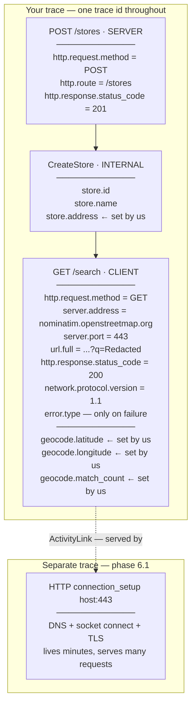

# Phase 6 — The network hop

**Question answered:** are outbound I/O calls instrumented manually, or is it
automatic?

**Status:** design settled, code not yet written. This file records the reasoning
first, because most of phase 6's value is in understanding what the single client
span does and does not mean.

---

## What changes

`POST /stores` stops leaving `Latitude` and `Longitude` null. It geocodes the
submitted address by calling Nominatim, the OpenStreetMap geocoding service:

```
GET https://nominatim.openstreetmap.org/search?q={address}&format=json&limit=1
```

Free, no key, no signup. Three things it demands:

| Requirement | Consequence |
|---|---|
| An identifying `User-Agent` | Generic ones get `403`. Postman's default is blocked. |
| Max 1 request per second | Fine for manual `.http` testing. |
| Empty array when nothing matches | `[]` is the "address not found" case, not an error status. |

One package is added — `OpenTelemetry.Instrumentation.Http` — and one line of
registration. That line is the whole phase.

---

## Data flow

```mermaid
sequenceDiagram
    autonumber
    participant C as Client / Postman
    participant S as StoreApi
    participant N as Nominatim

    C->>S: POST /stores
    Note over S: ASP.NET Core starts the SERVER span.<br/>Continues the caller's traceparent if sent,<br/>otherwise mints a new trace id.
    S->>S: CreateStore — INTERNAL span<br/>tags store.id, store.name
    S->>N: GET /search?q=...&format=json&limit=1<br/>traceparent injected automatically
    Note right of N: Nominatim receives the header.<br/>It does not report to our account,<br/>so no span appears on this side.
    N-->>S: 200 with lat/lon &nbsp;|&nbsp; [] &nbsp;|&nbsp; 403
    S-->>C: 201 Created + traceparent header
```

Nothing in that diagram requires propagation code.
`AddHttpClientInstrumentation()` writes the `traceparent` on the way out, and
ASP.NET Core reads it on the way in. It is the same header typed by hand in
phase 1 — the standard has not changed, only who types it.

---

## Span kinds

Three appear in this phase, and the distinction is not cosmetic — backends draw
service topology from it.

| Kind | Created by | Meaning |
|---|---|---|
| `Server` | ASP.NET Core | A request arrived here. |
| `Client` | HttpClient instrumentation | A request left here. |
| `Internal` | Our own `ActivitySource` | Work inside this process. `CreateStore` is one. |

---

## The span tree, and where attributes attach



### Attributes the library sets for free

`http.request.method`, `url.full`, `server.address`, `server.port`,
`http.response.status_code`, `network.protocol.version`, and `error.type` on
failure.

### Attributes worth adding ourselves

| Attribute | Why it earns its place |
|---|---|
| `store.address` | `url.full` **redacts query-string values by default**, so the address renders as `q=Redacted`. To be searchable it must be set deliberately, having first decided it is not sensitive. |
| `geocode.latitude` / `geocode.longitude` | The outcome of the call. Two small scalars. |
| `geocode.match_count` | Separates "no match" from "ambiguous match" without storing the body. |

### Attributes not worth adding

- **Whole response bodies.** Attributes are indexed and billed by the backend,
  and bodies carry unbounded size and PII. OpenTelemetry has no
  `http.response.body` convention for exactly this reason. Pick fields.
- **Aggregate metric values.** Stamping a p99 `time_in_queue` onto a span asserts
  a per-request fact that was never measured per request. See below.

---

## Why a real third party instead of a second service

The original spec built `src/OpenTelemetry.GeocodingApi` for StoreApi to call.
Calling Nominatim instead is a deliberate trade:

| | Local `GeocodingApi` | Nominatim |
|---|---|---|
| Client span in our trace | yes | yes |
| `traceparent` injected | yes | yes |
| Server span from the far side | **yes** | no |
| Continuation observable | **yes** | asserted only |
| Realistic failures and latency | staged | **real** |
| Second process to run | yes | no |

What is given up is precise: we see the header leave, but not anyone read it.
Nominatim receives a perfectly valid `traceparent` and ignores it, as every
uninstrumented service does.

If proof of injection is wanted without a second project, an echo endpoint such
as `https://httpbin.org/headers` returns the request headers it received as JSON
— the injected `traceparent` appears in the response body, and its trace id
matches the `traceparent` response header phase 4's middleware returns.

---

## The client span reports one number for five things

The client span's duration covers all of this, undivided:


A single `380ms` cannot be decomposed from the calling side. This matters because
the temptation is to read it as "the API is slow" and take it to the provider —
when several of those segments are entirely our own fault:

- **Pool starvation.** If every connection is busy, the request waits before a
  byte moves. Reported as `http.client.request.time_in_queue`.
- **Socket exhaustion.** `new HttpClient()` per request leaves sockets in
  `TIME_WAIT` for minutes; ephemeral ports run out and calls stall. Looks
  identical to "their API got slow".
- **Thread pool starvation.** The response arrives on time but nothing is free to
  run the continuation, so the span's *end* timestamp is late.

This is why the phase uses `IHttpClientFactory` rather than a bare `HttpClient`.
The tracing reason is that it is the idiomatic registration point; the more
important reason is that it pools and recycles `HttpMessageHandler`s, which is
the standard mitigation for the first two.

### What would separate the segments, and where it lives

| Signal | Answers | Built here? |
|---|---|---|
| `http.client.request.time_in_queue` | pool starvation | no — metrics are out of scope |
| `http.client.open_connections` | pool size and churn | no |
| `http.client.connection.duration` | reuse vs. constant reconnection | no |
| `dns.lookup.duration` | DNS cost | no |
| `Experimental.System.Net.Http.Connections` activity | setup cost | **phase 6.1** |
| `Server-Timing` response header | the remote side's own processing | Nominatim does not send it |

**What not to do:** reconstruct the split locally by timing the call twice,
subtracting a ping, or comparing against a health-check endpoint. Different
route, different connection, different cache state — the numbers will not mean
what you want them to mean. If the other side did not report how long it took, we
do not know.

For a third party the client span remains the *correct* measure of user impact —
it is what the caller experienced. It is simply a poor measure of *cause*.

---

## Preview: why connection setup is not a child span (phase 6.1)

Two hundred requests over a minute to the same host:

```
request #1     open connection: DNS + TCP + TLS = 200ms, then send/reply 10ms   → 210ms
request #2     connection already open → send/reply                             → 10ms
...
request #200   same                                                             → 10ms
```

The 200ms was paid once, by whoever went first. Making it a child span of request
#1 fails twice:

1. **Misattribution.** Request #1 would look pathological at 210ms with a 200ms
   child hanging under it, when nothing is wrong with it — it was merely first
   through the door. The cost belongs to *talking to that host at all*, shared by
   all 200 requests.
2. **Lifetimes do not nest.** The connection is still serving request #200 a
   minute later, long after request #1's span ended. A child cannot outlive its
   parent.

So .NET puts connection setup in **its own trace** and hangs an `ActivityLink`
off each client span meaning *"I was served by that connection."* A link is a
reference, not a containment claim; requests #1 and #147 both link to the same
connection and neither owns it.

Note that request #1's span duration genuinely *is* ~210ms — it really did wait.
The objection was never to the number, only to a tree shape that implies
ownership.

---

## Verify

1. `POST /stores` with a resolvable address → `201`, coordinates populated, and a
   trace whose waterfall is dominated by the Nominatim client span.
2. `POST /stores` with nonsense → the empty-array path fails the request, and the
   error is visible on the StoreApi spans.
3. Remove the configured `User-Agent`, or send the same URL from Postman with its
   default → client span tagged `http.response.status_code: 403`.
4. Compare the `traceparent` response header against the trace id in Better
   Stack — same value, as in phase 4.

---

## Concepts this phase answers

- Span kinds — server, client, internal — and why backends need them.
- Context propagation over HTTP is automatic on the calling side, and the
  injected header is the same standard typed by hand in phase 1.
- Query-string redaction, and why an attribute you want must be set knowingly.
- What a client span's duration blends together, and which signal separates each
  part.
- Why `IHttpClientFactory` is a correctness fix, not a style preference.
