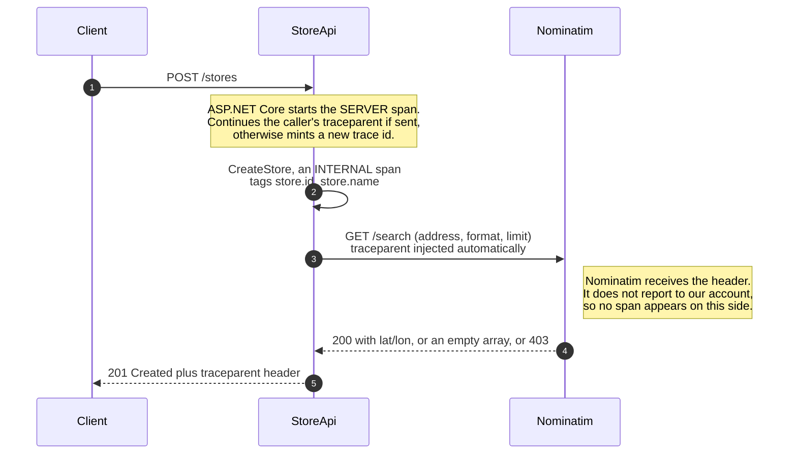
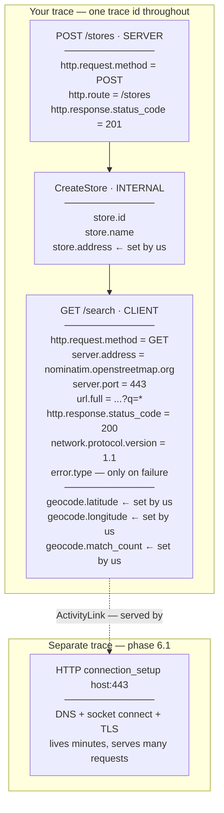

# Phase 6 — The network hop

**Question answered:** are outbound I/O calls instrumented manually, or is it
automatic?

**Status:** implemented. Most of this file is reasoning rather than code, because
the code is one package and a handful of lines, while what the resulting client
span does and does not mean takes longer to state.

---

## What changes

`POST /stores` stops leaving `Latitude` and `Longitude` null. It geocodes the
submitted address by calling Nominatim, the OpenStreetMap geocoding service:

```
GET https://nominatim.openstreetmap.org/search?q={address}&format=json&limit=1
```

Free, no key, no signup. Three things it demands:

| Requirement | Consequence |
|---|---|
| An identifying `User-Agent` | Generic ones get `403`. Postman's default is blocked. |
| Max 1 request per second | Fine for manual `.http` testing. |
| Empty array when nothing matches | `[]` is the "address not found" case, not an error status. |

One package is added — `OpenTelemetry.Instrumentation.Http` — and one line of
registration. That line is the whole phase.

---

## Data flow



Nothing in that diagram requires propagation code.
`AddHttpClientInstrumentation()` writes the `traceparent` on the way out, and
ASP.NET Core reads it on the way in. It is the same header typed by hand in
phase 1 — the standard has not changed, only who types it.

---

## Span kinds

Three appear in this phase, and the distinction is not cosmetic — backends draw
service topology from it.

| Kind | Created by | Meaning |
|---|---|---|
| `Server` | ASP.NET Core | A request arrived here. |
| `Client` | HttpClient instrumentation | A request left here. |
| `Internal` | Our own `ActivitySource` | Work inside this process. `CreateStore` is one. |

---

## The span tree, and where attributes attach



### Attributes the library sets for free

`http.request.method`, `url.full`, `server.address`, `server.port`,
`http.response.status_code`, `network.protocol.version`, and `error.type` on
failure.

### Attributes worth adding ourselves

| Attribute | Why it earns its place |
|---|---|
| `store.address` | `url.full` **redacts query-string values by default**, so the address renders as `search?q=*`. To be searchable it must be set deliberately, having first decided it is not sensitive. |
| `geocode.latitude` / `geocode.longitude` | The outcome of the call. Two small scalars. |
| `geocode.match_count` | Separates "no match" from "ambiguous match" without storing the body. |

### Attributes not worth adding

- **Whole response bodies.** Attributes are indexed and billed by the backend,
  and bodies carry unbounded size and PII. OpenTelemetry has no
  `http.response.body` convention for exactly this reason. Pick fields.
- **Aggregate metric values.** Stamping a p99 `time_in_queue` onto a span asserts
  a per-request fact that was never measured per request. See below.


---

## Enrichment: the hook, and where it is the wrong tool

OpenTelemetry supplies every attribute in the HTTP Client semantic conventions
without help. Enrichment exists for the rest, and the instrumentation library
offers three hooks:

```csharp
.AddHttpClientInstrumentation(options =>
{
    options.EnrichWithHttpRequestMessage = (activity, request) =>
        activity.SetTag("http.client.name", "Geocoding");

    options.EnrichWithHttpResponseMessage = (activity, response) =>
    {
        if (response.Headers.TryGetValues("Server-Timing", out var v))
            activity.SetTag("http.server_timing", string.Join(",", v));
    };

    options.EnrichWithException = (activity, exception) =>
        activity.SetTag("geocode.failure", exception.GetType().Name);
})
```

Two facts about how they run:

- They are called **only when `activity.IsAllDataRequested` is `true`** — that
  is, only for sampled activities. An enricher that appears dead is often just
  attached to an unsampled span.
- Order is: processor `OnStart` → request enrichment → exception enrichment →
  response enrichment → processor `OnEnd`.

### Why the geocoding results are *not* set by an enricher

`geocode.latitude`, `geocode.longitude` and `geocode.match_count` come from the
**response body**, and `EnrichWithHttpResponseMessage` is the wrong place to read
a body: the callback is synchronous, and consuming or buffering the content
stream there interferes with the caller that is about to read it properly.

So the division is:

| Source of the value | Where it is set |
|---|---|
| Request or response **metadata** — headers, version, client name | client span, via an enricher |
| Response **body**, after parsing | our own `CreateStore` span, in the handler |
| Anything the semantic conventions already define | nowhere — it is already there |

This is why the span tree above shows `geocode.*` on the client span
conceptually, but the code will set them on `CreateStore`. Recorded here so the
discrepancy is deliberate rather than an oversight.

---

## What comes from OpenTelemetry, and what comes from .NET

Worth separating, because "the .NET docs say X" and "OpenTelemetry says X" have
been used interchangeably above.

| Concern | Whose rule |
|---|---|
| Which attributes an HTTP client span carries, and their names | **OpenTelemetry** — HTTP Client Semantic Conventions. .NET states it follows them. |
| Span kinds; links vs. parent-child | **OpenTelemetry** — `ActivityLink` is .NET's spelling of an OTel Link. |
| The `System.Net.Http` metric names | **OpenTelemetry** — standardised in the semconv `dotnet` namespace. |
| That connection setup is a root span and queue wait is a child | **.NET** — a modelling decision, not something OTel mandates. |
| `traceparent` on the wire | **W3C**, older than both. |
| Enrichment, filtering | **OpenTelemetry .NET** — the instrumentation library, not the runtime. |

On .NET 9+ the runtime creates the HTTP client activity itself, from the native
`System.Net.Http` source. The instrumentation library's README states it "will
not add/change/override any attributes set by the native instrumentation but it
is still required for performing context propagation... and supports additional
features not available in runtime (enrichment, filtering, etc.)."

That is the same lesson as phase 5, one layer out: the runtime records, and
OpenTelemetry collects and standardises. Whether the `traceparent` injection on
.NET 10 comes from the runtime or from the package is worth confirming by
experiment when the code exists — the README's wording and .NET's own
`DistributedContextPropagator` both have a claim on it.

### What no specification can give us

The remote server's own processing time, when the remote is not instrumented.
OpenTelemetry standardises how to *record* a client span; it cannot conjure data
from a service that reports nothing. W3C Trace Context Level 2 defines a
`traceresponse` header, but it returns identifiers, not timing, and Nominatim
does not send it. The limit is real and no library removes it.

---

## Why a real third party instead of a second service

The original spec built `src/OpenTelemetry.GeocodingApi` for StoreApi to call.
Calling Nominatim instead is a deliberate trade:

| | Local `GeocodingApi` | Nominatim |
|---|---|---|
| Client span in our trace | yes | yes |
| `traceparent` injected | yes | yes |
| Server span from the far side | **yes** | no |
| Continuation observable | **yes** | asserted only |
| Realistic failures and latency | staged | **real** |
| Second process to run | yes | no |

What is given up is precise: we see the header leave, but not anyone read it.
Nominatim receives a perfectly valid `traceparent` and ignores it, as every
uninstrumented service does.

If proof of injection is wanted without a second project, an echo endpoint such
as `https://httpbin.org/headers` returns the request headers it received as JSON
— the injected `traceparent` appears in the response body, and its trace id
matches the `traceparent` response header phase 4's middleware returns.

---

## The client span reports one number for five things

The client span's duration covers all of this:


**Correction to an earlier draft of this note:** two of those five *are*
separately observable on .NET 9+, through the experimental activities covered in
phase 6.1 — see the table below. What stays inseparable from the calling side is
transit out, Nominatim's own processing, and transit back. That residue is the
real limit.

It matters because the temptation is to read a single `380ms` as "the API is
slow" and take it to the provider — when several segments are entirely our own
fault:

- **Pool starvation.** If every connection is busy, the request waits before a
  byte moves. Reported as `http.client.request.time_in_queue`.
- **Socket exhaustion.** `new HttpClient()` per request leaves sockets in
  `TIME_WAIT` for minutes; ephemeral ports run out and calls stall. Looks
  identical to "their API got slow".
- **Thread pool starvation.** The response arrives on time but nothing is free to
  run the continuation, so the span's *end* timestamp is late.

This is why the phase uses `IHttpClientFactory` rather than a bare `HttpClient`.
The tracing reason is that it is the idiomatic registration point; the more
important reason is that it pools and recycles `HttpMessageHandler`s, which is
the standard mitigation for the first two.

### What would separate the segments, and where it lives

| Signal | Kind | Answers | Built here? |
|---|---|---|---|
| `...Connections.WaitForConnection` activity | **child span** of the client span | time queued for a free connection | **phase 6.1** |
| `...Connections.ConnectionSetup` activity | **root span, linked** | DNS + socket + TLS cost | **phase 6.1** |
| `...NameResolution.DnsLookup` activity | child of connection setup | DNS cost alone | phase 6.1, if useful |
| `...Sockets.Connect`, `...Security.TlsHandshake` | children of connection setup | socket and TLS cost | phase 6.1, if useful |
| `http.client.request.time_in_queue` | metric | queueing, in aggregate | no — metrics are out of scope |
| `http.client.open_connections` | metric | pool size and churn | no |
| `http.client.connection.duration` | metric | reuse vs. constant reconnection | no |
| `Server-Timing` response header | header | the remote side's own processing | Nominatim does not send it |

All five activities are marked **experimental** by .NET and may change or be
removed. They are also `Experimental.*`-prefixed sources, so nothing appears
unless explicitly subscribed to.

**What not to do:** reconstruct the split locally by timing the call twice,
subtracting a ping, or comparing against a health-check endpoint. Different
route, different connection, different cache state — the numbers will not mean
what you want them to mean. If the other side did not report how long it took, we
do not know.

For a third party the client span remains the *correct* measure of user impact —
it is what the caller experienced. It is simply a poor measure of *cause*.

---

## Preview: why connection setup is not a child span (phase 6.1)

Two hundred requests over a minute to the same host:

```
request #1     open connection: DNS + TCP + TLS = 200ms, then send/reply 10ms   → 210ms
request #2     connection already open → send/reply                             → 10ms
...
request #200   same                                                             → 10ms
```

The 200ms was paid once, by whoever went first. Making it a child span of request
#1 fails twice:

1. **Misattribution.** Request #1 would look pathological at 210ms with a 200ms
   child hanging under it, when nothing is wrong with it — it was merely first
   through the door. The cost belongs to *talking to that host at all*, shared by
   all 200 requests.
2. **Lifetimes do not nest.** The connection is still serving request #200 a
   minute later, long after request #1's span ended. A child cannot outlive its
   parent.

So .NET puts connection setup in **its own trace** and hangs an `ActivityLink`
off each client span meaning *"I was served by that connection."* A link is a
reference, not a containment claim; requests #1 and #147 both link to the same
connection and neither owns it.

The contrast that makes the rule concrete is that .NET models the *queue wait*
the opposite way. `HTTP wait_for_connection` **is** a child of the client request
span, because waiting is genuinely part of that one request and ends before it
does. Same feature area, two different structural choices, decided by the same
test:

| | Belongs to | Modelled as |
|---|---|---|
| `wait_for_connection` | this one request | **child span** |
| `connection_setup` | the connection, shared | **root span + link** |

Ask *whose cost is this, and does it end before the request does* — the answer
picks the edge type.

Note that request #1's span duration genuinely *is* ~210ms — it really did wait.
The objection was never to the number, only to a tree shape that implies
ownership.

---

## Verify

1. `POST /stores` with a resolvable address → `201`, coordinates populated, and a
   trace whose waterfall is dominated by the Nominatim client span.
2. `POST /stores` with nonsense → the empty-array path fails the request, and the
   error is visible on the StoreApi spans.
3. Remove the configured `User-Agent`, or send the same URL from Postman with its
   default → client span tagged `http.response.status_code: 403`.
4. Compare the `traceparent` response header against the trace id in Better
   Stack — same value, as in phase 4.

---

## Concepts this phase answers

- Span kinds — server, client, internal — and why backends need them.
- Context propagation over HTTP is automatic on the calling side, and the
  injected header is the same standard typed by hand in phase 1.
- Query-string redaction, and why an attribute you want must be set knowingly.
- What a client span's duration blends together, and which signal separates each
  part.
- Why `IHttpClientFactory` is a correctness fix, not a style preference.
- Enrichment: what it is for, when it is the wrong tool, and that it only runs
  for sampled activities.
- Which rules come from OpenTelemetry, which from .NET, and which from W3C.

## Sources

- [Built-in activities in .NET](https://learn.microsoft.com/dotnet/core/diagnostics/distributed-tracing-builtin-activities#systemnet-activities)
  — the client request, wait-for-connection, connection setup, DNS, socket and
  TLS activities, and the root-plus-link rule quoted above.
- [System.Net metrics](https://learn.microsoft.com/dotnet/core/diagnostics/built-in-metrics-system-net)
- [OpenTelemetry.Instrumentation.Http README](https://github.com/open-telemetry/opentelemetry-dotnet-contrib/blob/main/src/OpenTelemetry.Instrumentation.Http/README.md)
  — enrichment hooks, callback order, and the .NET 9+ native-instrumentation note.
- [OpenTelemetry HTTP Client Semantic Conventions](https://opentelemetry.io/docs/specs/semconv/http/http-spans/#http-client)
